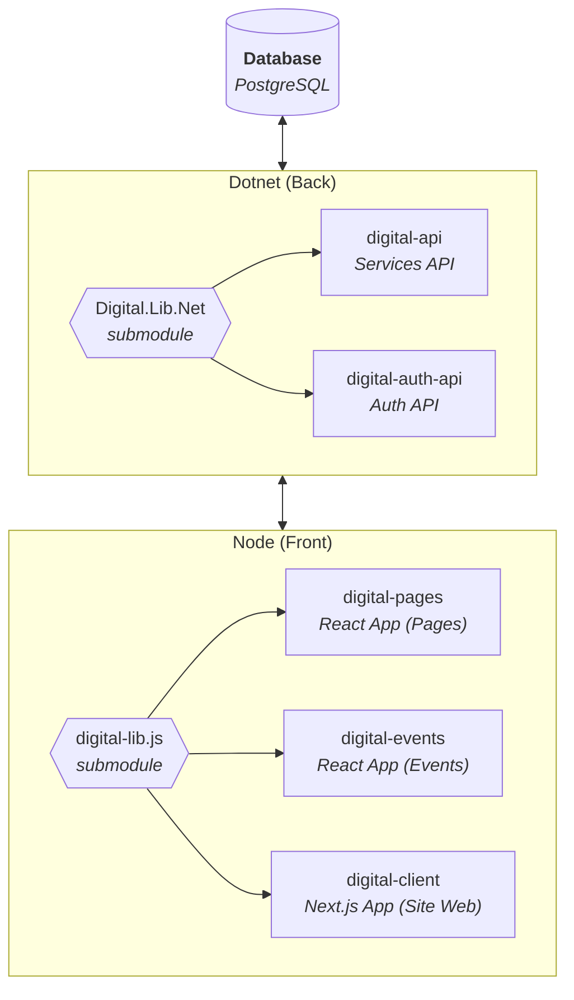

# Digital.net - Architecture

**Digital.net** is a suite of services designed to simplify website management. It includes several applications that allow administrators to manage different aspects of the site.

## 📌 Applications

- **Website Page Management** → `digital-pages` *(React App)*  
  Allows users to create and edit website pages and write and manage blog articles through an intuitive interface.
  
- **Event Management** → `digital-events` *(React App)*  
  Enables the creation and management of events that end users can register for.

- **Website** → `digital-client` *(Next.js App)*  
  The public-facing website for end users.

## 🔗 API & Authentication

- **Authentication API** → `digital-auth-api` *(Dotnet App)*  
  Manages authentication for the React applications used by administrators.

- **Service API** → `digital-api` *(Dotnet App)*  
  Manages the services associated with the various applications.

## 📦 Core Libraries

At the heart of the project, two libraries facilitate code sharing between applications:

- **Digital.Lib.Net** *(Dotnet backend library)*
- **digital-lib.js** *(JS frontend library)*

These libraries are integrated using *Git Submodules*.

## 🗄️ Database

The entire configuration and data management are handled by a central database, which defines:
- Enabled features
- Authentication management
- Data for articles, events, and other services

## 🔹 Architecture Diagram

